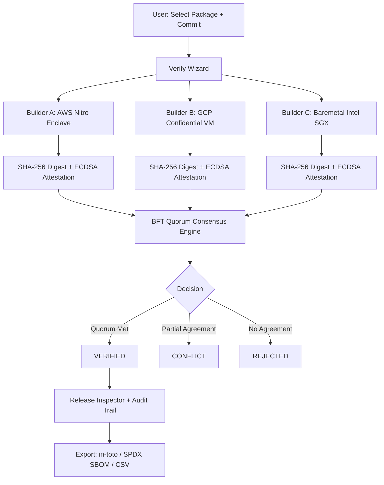

# Quorum — Supply Chain Verifier

A decentralized software supply-chain verification engine using multi-builder reproducible builds, cryptographic attestations, and Byzantine Fault Tolerant quorum consensus.

---

## Problem Statement

Modern software distribution has a fundamental trust gap. When you download a package from NPM, PyPI, or GitHub Releases, you are trusting that the compiled binary was actually built from the open-source commit the author claims. In reality, a single compromised CI runner or developer machine can silently inject a backdoor into the released binary without touching the source repository — exactly what happened in the **SolarWinds** and **XZ Utils** supply chain attacks.

The root vulnerability: **users trust the binary. Nobody independently verifies it.**

---

## Our Solution

Quorum solves this by dispatching the same build task to **multiple independent enclave runners** (AWS Nitro Enclaves, GCP Confidential VMs, Baremetal Intel SGX) simultaneously. Each builder produces a cryptographic attestation — an ECDSA P-256 signature over the SHA-256 digest of its compiled artifact. A **Byzantine Fault Tolerant (BFT) quorum consensus engine** then compares digests across all builders and issues one of three decisions:

- `VERIFIED` — quorum threshold met, artifact is reproducible and authentic
- `CONFLICT` — builders disagree but no clear majority; release blocked
- `REJECTED` — quorum not met or all attestations invalid

If even one rogue or compromised builder injects a tampered binary, the divergent digest is caught and isolated by the majority.

---

## Key Features

- **Verify Wizard** — step-by-step UI to configure and simulate a multi-builder verification run against real open-source packages
- **Real Package Benchmark** — uses actual `sigstore/cosign v2.4.1` commit hash and expected SHA-256 digest as a reference target
- **WebCrypto ECDSA Attestations** — real browser-native ECDSA P-256 / SHA-256 signing and verification via the Web Cryptography API (no mocks for the crypto layer)
- **BFT Quorum Consensus Engine** — dynamically computes VERIFIED / CONFLICT / REJECTED decisions from builder evidence with configurable thresholds
- **Release Inspector** — deep-dive view per verification: quorum decision, per-builder attestation cards, live signature re-verification, binary diff viewer, Merkle proof display, and full chronological audit trail
- **Tamper Detection Demo** — interactive attack simulation with 3 scenarios: clean 3/3 consensus, 1/3 rogue builder, and total discord (0/3 agreement)
- **Attestation History** — searchable and filterable immutable log of all verification records and builder node status
- **Export Functionality** — download in-toto SLSA Provenance v1.0 JSON, SPDX 2.3 SBOM JSON, and CSV audit trail
- **Verification Test Suite** — 14 deterministic in-browser tests covering SHA-256 hashing, ECDSA sign/verify, full quorum logic, tamper detection, Byzantine fault isolation, and SBOM export
- **LocalStorage Persistence** — verification records survive page refreshes

---

## How It Works

```
User selects package & pinned commit
        ↓
Verify Wizard dispatches build to 3 independent enclave runners (simulated)
        ↓
Each builder: compiles artifact → computes SHA-256 → signs with ECDSA P-256
        ↓
Quorum engine compares digests across attestations
        ↓
BFT decision: VERIFIED / CONFLICT / REJECTED
        ↓
Full audit trail generated → exportable as in-toto / SPDX SBOM / CSV
```

The 6-step Quorum protocol:
1. **Pin source commit** — immutable Git tree SHA (not a mutable branch or tag)
2. **Independent builder enclaves** — AWS Nitro, GCP Confidential VM, Baremetal Intel SGX
3. **Reproducible builds** — zero timestamps, fixed paths, deterministic compiler flags
4. **Artifact SHA-256 digest** — each isolated builder computes its own hash
5. **ECDSA attestation** — each builder signs its canonical payload
6. **Quorum consensus** — BFT majority vote determines final decision

---

## Architecture



> All builder runners are **simulated** in this prototype. The cryptographic layer (WebCrypto ECDSA P-256, SHA-256) uses real browser-native APIs.

---

## Tech Stack

**Frontend**
- React 19, TypeScript, Vite 8
- Tailwind CSS v4
- Framer Motion (`motion`)
- Lucide React + Material Symbols icons
- Geist + JetBrains Mono fonts

**Cryptography**
- Browser Web Cryptography API — ECDSA P-256 / SHA-256 (native, no library)
- Software fallback for environments without WebCrypto

**State & Storage**
- React `useState` / `useEffect`
- `localStorage` for persistence

**Build & Tooling**
- Vite 8, esbuild 0.28, tsx, TypeScript 7

---

## Project Structure

```
├── src/
│   ├── App.tsx                        # Root: tab routing, global state, toast
│   ├── main.tsx                       # React entry point
│   ├── index.css                      # Tailwind theme tokens + design system
│   ├── components/
│   │   ├── Header.tsx                 # Fixed top bar with inline SVG logo
│   │   ├── BottomNav.tsx              # 5-tab mobile navigation
│   │   ├── DashboardView.tsx          # Metrics, featured benchmark, active run
│   │   ├── VerifyWizardView.tsx       # 3-step verification wizard
│   │   ├── ReleaseInspectorView.tsx   # Deep-dive attestation inspector + exports
│   │   ├── AttestationsHistoryView.tsx# Searchable history log + CSV export
│   │   ├── TamperDemoView.tsx         # Interactive attack simulation
│   │   ├── VerificationTestSuite.tsx  # 14 deterministic in-browser tests
│   │   └── DocsModal.tsx              # Protocol specification modal
│   ├── types/
│   │   └── quorum.ts                  # All TypeScript interfaces and types
│   ├── data/
│   │   └── initialData.ts             # Seed verification records + builder nodes
│   └── utils/
│       └── crypto.ts                  # WebCrypto ECDSA, SHA-256, quorum engine, exports
├── index.html
├── package.json
├── tsconfig.json
├── vite.config.ts
└── .env.example
```

---

## Getting Started

### Prerequisites
- Node.js 18+
- npm 9+

### Installation

```bash
# Clone the repository
git clone https://github.com/aditidange29-git/Bnb26_404-Found_Internal_Round.git
cd Bnb26_404-Found_Internal_Round

# Install dependencies
npm install
```

### Running Locally

```bash
npm run dev
```

Opens at `http://localhost:3000`

### Build for Production

```bash
npm run build
npm run preview
```

---

## Environment Variables

Copy `.env.example` to `.env.local`:

```bash
cp .env.example .env.local
```

| Variable | Required | Description |
|---|---|---|
| `GEMINI_API_KEY` | No | Only needed if adding Gemini AI features. Not used in current implementation. |
| `APP_URL` | No | Public URL for production deployments. Leave empty for local dev. |

> The app runs fully client-side with no API calls required. You can run it without setting any environment variables.

---

## Usage

1. **Dashboard** — view live telemetry metrics and the featured `sigstore/cosign` real-package benchmark
2. **Verify tab** — configure a new verification: pick a preset package (cosign, hyperledger/besu, kubernetes gateway-api), choose consensus or divergent demo path, and step through the wizard
3. **Releases tab** — browse the full history of verification records, search by package name or commit hash, export CSV audit trail
4. **Tamper tab** — switch between 3 attack scenarios and watch the quorum engine isolate the rogue builder
5. **Attest tab** — view builder node registry and attestation details
6. **Test Suite button** (header) — run all 14 deterministic verification tests live in the browser

---

## Screenshots / Demo

> Demo link: _not yet deployed — run locally with `npm run dev`_

---

## Hackathon Relevance

Software supply chain security is one of the most critical and underserved problems in modern infrastructure. Attacks like SolarWinds ($18B+ impact) and XZ Utils demonstrated that a single point of compromise in the build pipeline can affect millions of downstream users.

Quorum directly addresses this by implementing the core technical primitive missing from most supply chains: **independent, multi-party reproducible build verification with cryptographic attestations**. The implementation uses:

- Real browser WebCrypto ECDSA P-256 — not mock signatures
- A genuine BFT consensus algorithm that dynamically handles disagreement, invalid attestations, and Byzantine faults
- SLSA Level 4 provenance model aligned with industry standards (in-toto, SPDX, sigstore)
- A real open-source package (`sigstore/cosign v2.4.1`) as the benchmark, with its actual pinned commit and expected SHA-256 digest

---

## Future Improvements

- Connect to real distributed build infrastructure (Tekton, GitHub Actions OIDC) instead of simulated runners
- Integrate actual hardware TEE attestation reports (AWS Nitro NSM, Intel SGX DCAP)
- On-chain attestation anchoring (Ethereum, Sigstore Rekor transparency log)
- Gemini AI-powered anomaly detection across attestation history
- Browser extension for automatic package verification at install time
- Support for more artifact formats: OCI images, Cargo crates, Python wheels

---

## Team

| Name | Role |
|---|---|
| _(add team members)_ | _(add roles)_ |

---

## License

Apache-2.0 — see source file headers.
